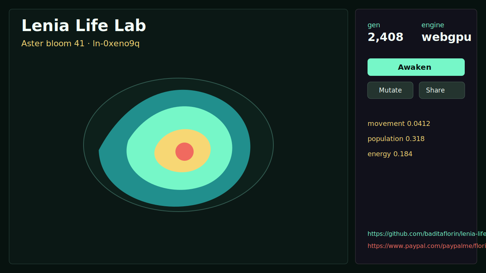
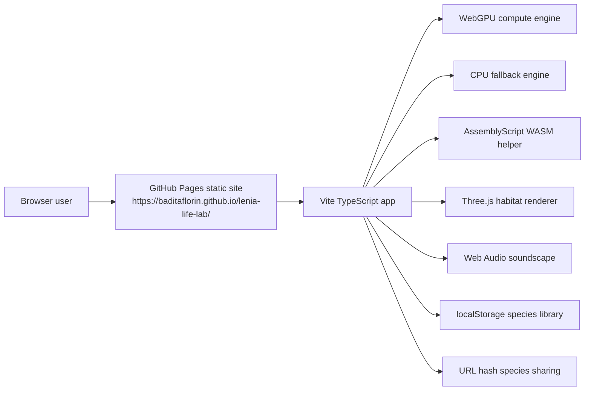

# Lenia Life Lab


Live site: https://baditaflorin.github.io/lenia-life-lab/

Repository: https://github.com/baditaflorin/lenia-life-lab

Support: https://www.paypal.com/paypalme/florinbadita

Lenia Life Lab is a static WebGPU playground for breeding, hearing, saving, and sharing continuous cellular automata creatures. It runs entirely in the browser: WebGPU powers the simulation when available, a TypeScript CPU engine covers fallback browsers, AssemblyScript/WASM supplies deterministic math helpers, Three.js renders the habitat, Web Audio turns motion into sound, and URL hashes carry species genomes.



## Quickstart

```bash
npm install
make install-hooks
make dev
make test
make smoke
```

## What Works In V1

- Mutate and crossbreed Lenia species from compact parameter genomes.
- Share any species with a static URL hash.
- Save up to 24 local species in browser storage.
- Generate a soundscape from movement, population, energy, and centroid changes.
- Show app version and source commit on the published page.
- Link directly to the GitHub repository and PayPal support page from the live app.

## Architecture



Architecture docs: docs/architecture.md

ADRs: docs/adr/

Deploy guide: docs/deploy.md

Privacy: docs/privacy.md

Postmortem: docs/postmortem.md

## Pages Build

GitHub Pages serves the committed `docs/` directory from `main`. `make build` rebuilds that directory with the correct `/lenia-life-lab/` base path and hashed assets.

```bash
make build
make pages-preview
```

## Checks

```bash
make lint
make test
make smoke
make audit
```

No GitHub Actions are used. Local hooks live in `.githooks/` and are installed with `make install-hooks`.
