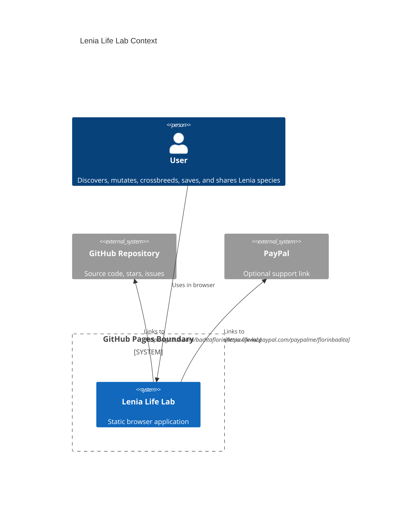
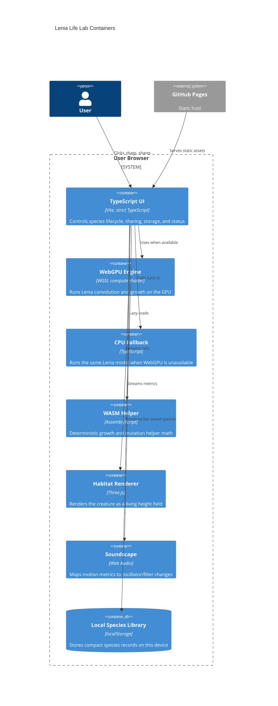

# Architecture

Lenia Life Lab is Mode A: Pure GitHub Pages. The runtime surface is a static site at https://baditaflorin.github.io/lenia-life-lab/ with no backend, no database, no runtime secrets, and no authentication.

## Context

## Containers

## Module Boundaries

- `src/features/lenia/`: species schema, mutation, crossover, simulation engines, and metrics.
- `src/features/audio/`: Web Audio graph.
- `src/features/library/`: local storage persistence.
- `src/features/share/`: URL hash encoding and decoding.
- `src/rendering/`: Three.js renderer.
- `src/wasm/`: WASM loader and generated `lenia.wasm`.
- `src/app/`: DOM orchestration.

## Static Boundary

All computation happens in the browser. The app does not send species, metrics, audio events, or saved records to a server.
